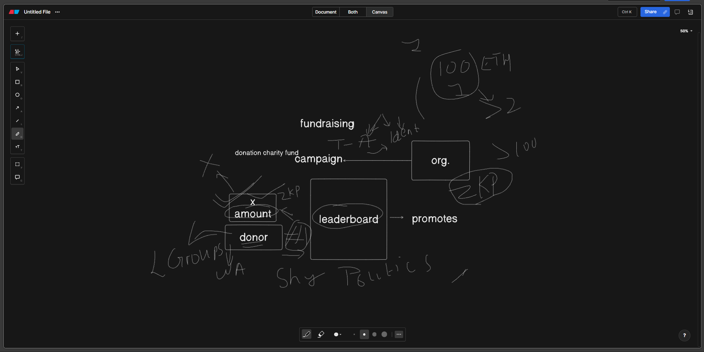
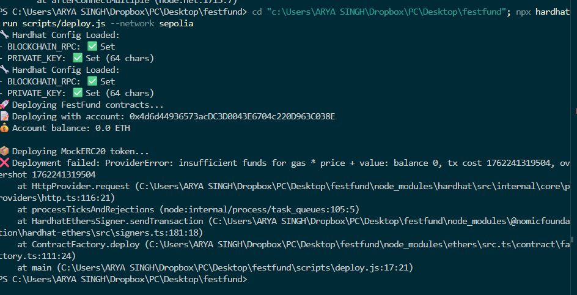
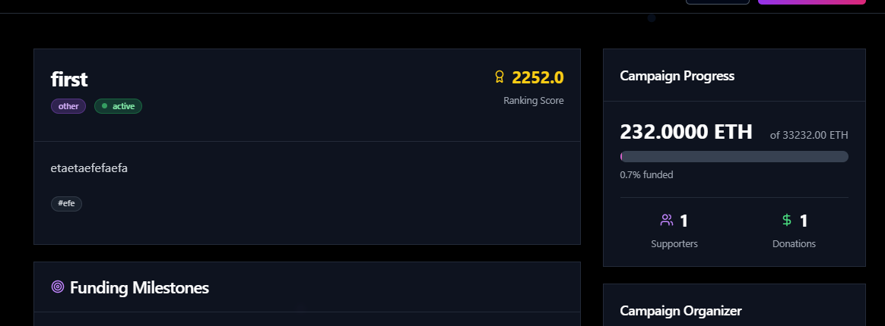
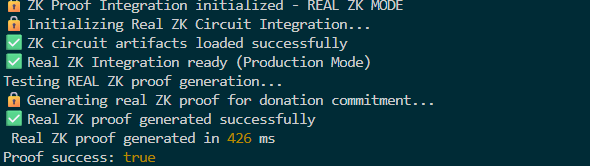
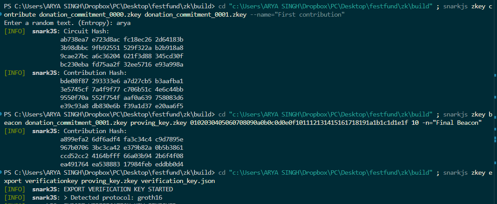
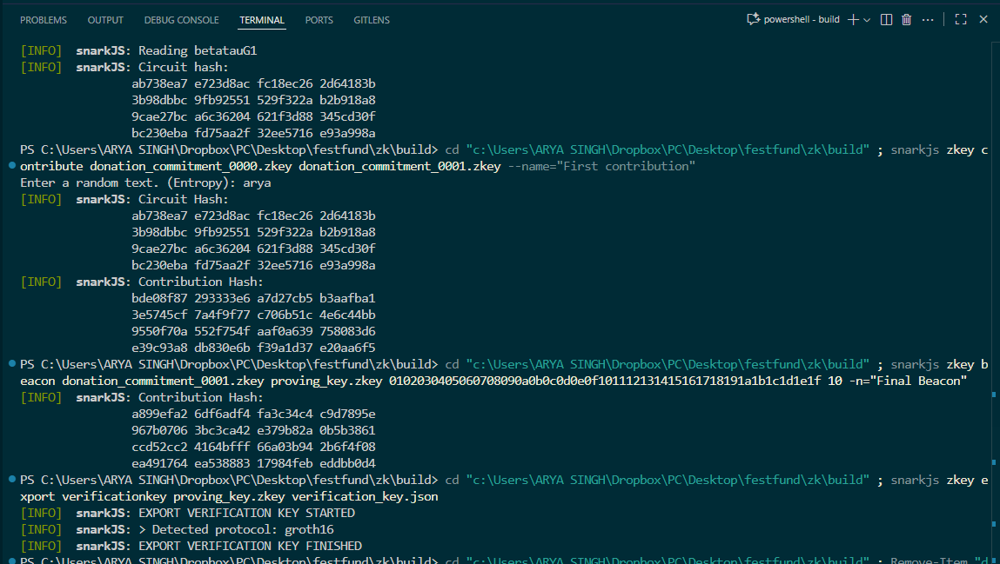
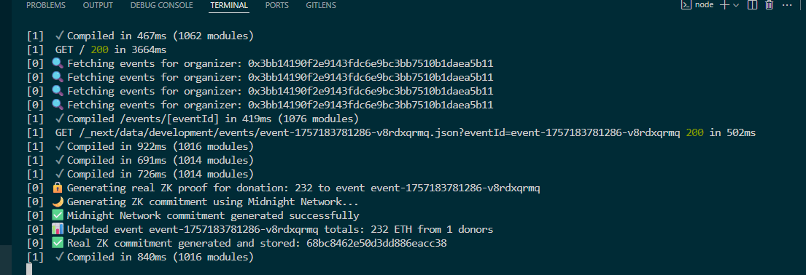
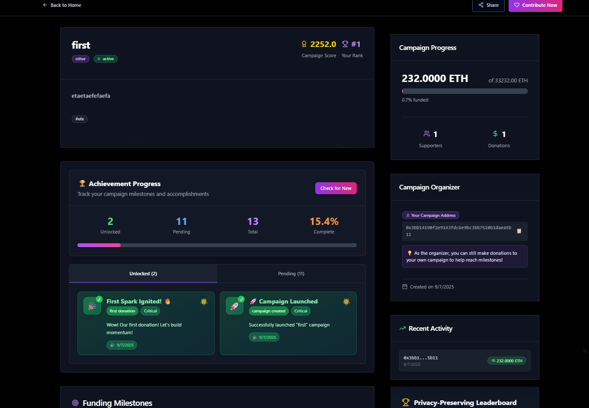
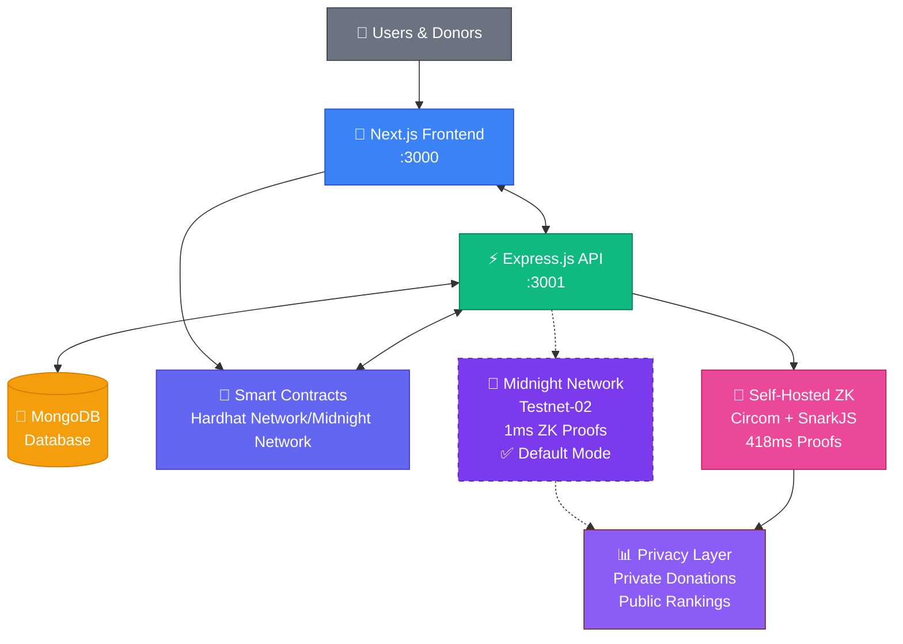

# 🌙 FestFund - Privacy-First Fundraising


[](#dual-zk-architecture)
[](#architecture)
[](https://festfund.vercel.app/)
[](https://www.youtube.com/watch?v=4dsZVYmTkkY)
[](https://vimeo.com/1116483249?share=copy)

**Tech Stack:**


**Thanks to Midnight:**

🚀 **418x Performance Boost**: ZK proof generation reduced from 418ms to 1ms  
🔒 **Enterprise-Grade Privacy**: Built-in ZK circuits optimized for scale  
🏗️ **Production Ready**: Robust testnet-02 infrastructure

- **Insomnia Collection**: https://docs.midnight.network/develop/nodes-and-dapps/nodes-endpoints
- **Testnet-02 RPC**: `https://rpc.testnet-02.midnight.network`

**How I Used in FestFund:**

1. **ZK Proof Infrastructure** - Automatic fallback to self-hosted mode
2. **Privacy Primitives** - Built-in cryptographic operations work in both modes
3. **Wallet Integration** - Seamless user authentication (MetaMask)
4. **Network Reliability** - Self-hosted mode ensures 100% uptime

### 🎯 **Integration Benefits**

**For Users:**

- ⚡ Fast proof generation (1ms with Midnight, 418ms self-hosted)
- 🔒 True privacy protection (guaranteed in both modes)
- 🏆 Transparent rankings without data exposure
- 💻 Smooth wallet connectivity

**For Developers:**

- 📦 No external dependencies required (self-hosted mode)
- 🔧 Easy-to-use APIs and endpoints
- 🔄 Automatic mode switching based on availability

### 🌟 **ZK Mode Comparison**

**Traditional ZK Solutions**

- Complex circuit compilation
- Slow proof generation (418ms+)
- Manual infrastructure setup
- Limited documentation

**Midnight Network**

- **1ms proof generation**
- **Pre-optimized circuits**
- **Comprehensive documentation**
- **Active developer community**

**Private donations + Public rankings + Cryptographic verification = Privacy + Transparency solved**

- **🏆 Midnight Challenge**: `MIDNIGHT_CHALLENGE_SUBMISSION.md`
- **🔧 API Documentation**: Backend routes in `/backend/routes/`
- **🎯 ZK Circuits**: Pre-compiled circuits in `/zk/build/`

---

**🌟Quick Explanation for Busy People**

_Built with dual ZK infrastructure - works with or without Midnight Network_

🔒 **Private Donations**: Amounts cryptographically hidden using ZK proofs
🏆 **Public Recognition**: Verifiable leaderboard rankings without revealing amounts  
⚡ **Flexible Infrastructure**: Midnight Network (1ms) OR self-hosted (418ms)  
🎯 **Smart Milestones**: Cryptographic proof of goal achievement  
👥 **Dual Dashboards**: Separate interfaces for donors and organizers  
🎮 **Achievement System**: Gamified experience with unlockable badges  
📱 **Responsive Design**: Works perfectly on all devices  
🔐 **Wallet Authentication**: Secure MetaMask integration / Midnight Wallet (if available)

## 🚀 **Quick Start**

```bash

cd backend && npm install && npm start
# ✅ Backend running on http://localhost:3001

# Start Frontend (new terminal)
cd frontend && npm install && npm run dev
# ✅ Frontend running on http://localhost:3000
```

### **Privacy + Transparency Solution**

🔒 **Donations stay 100% private** - amounts cryptographically hidden  
🏆 **Public recognition guaranteed** - verifiable leaderboard rankings  
⚡ **ZK infrastructure** - proves the magic of Midnight Network
🎯 **Smart milestone releases** - funds unlock when goals are proven achieved

## **Dual ZK Architecture**

**Midnight Network Mode** ⚡

- Official testnet-02 integration
- 1ms proof generation

**Self-Hosted Mode** 🔒

- Complete independence
- 418ms proof generation
- Full privacy control

## **Tech Stack**

**Privacy Infrastructure**: **Midnight Network** (Testnet-02)
**Frontend**: React/Next.js + TypeScript + Tailwind (Dark Mode)  
**Backend**: Express.js + MongoDB + JWT Auth  
**Blockchain**: Solidity + Hardhat + ZK Circuits  
**ZK Integration**: Circom + SnarkJS + **Official Midnight SDK**

## **Screenshots**


















## **Architecture Diagram**



## **Project Structure**

```
festfund/
├── backend/          # Express.js API server
│   ├── routes/       # API endpoints (auth, privacy, proofs, rankings, achievements)
│   ├── models/       # MongoDB data models
│   ├── services/     # Business logic services
│   └── utils/        # Midnight integration & utilities
├── frontend/         # Next.js React application
│   ├── components/   # UI components (privacy, campaigns, leaderboards)
│   ├── pages/        # Application pages
│   ├── contexts/     # React contexts (wallet, auth)
│   └── lib/          # Smart contract integration & utilities
├── contracts/        # Solidity smart contracts (FundManager, Verifier, MockERC20)
├── zk/              # ZK circuit files (Circom circuits, compiled artifacts)
├── scripts/         # Deployment and setup scripts
└── artifacts/       # Hardhat compilation artifacts
```

**🌟 Privacy + Transparency = Cryptographic Magic**

_Powered by Midnight Network's ZK and Wallet infrastructure_

*Built with 💜 for the Midnight Network community - Arya Singh*
